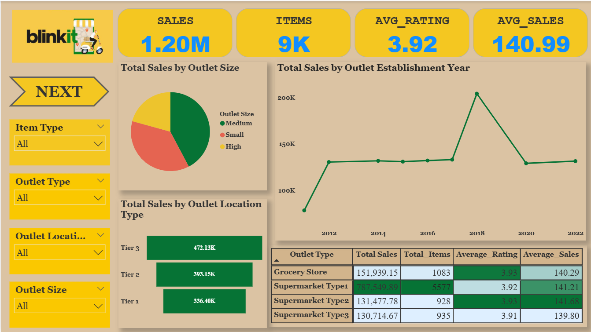
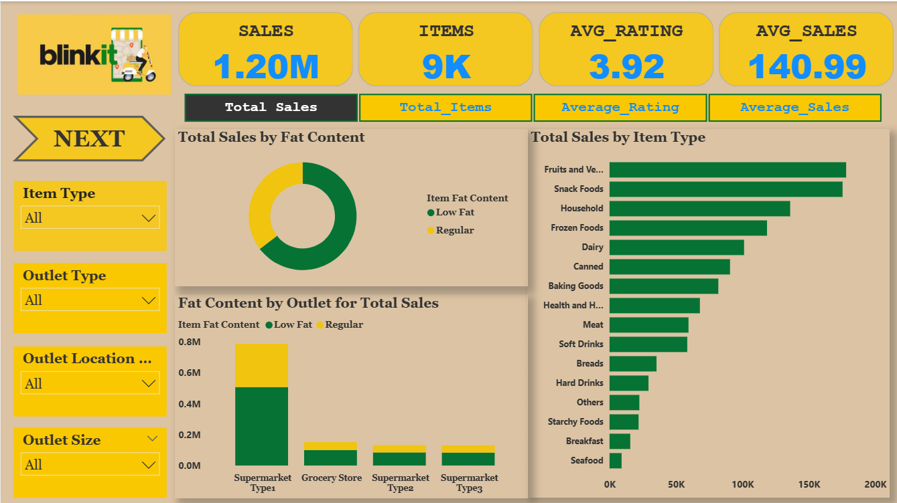

# 🛒 Blinkit Sales Analysis – Power BI Dashboard

## 📌 Overview
This project presents an interactive Power BI dashboard analyzing Blinkit sales data. It provides insights into product performance, customer demand, and overall business trends to support data-driven decision-making.

---

## 🎯 Objectives
- Analyze overall sales and revenue performance  
- Identify top-performing products and categories  
- Understand customer purchasing behavior  
- Track trends over time  

---

## 📈 Key Insights
- Top-selling products and categories  
- Revenue distribution across outlets  
- Customer demand patterns  
- Seasonal or time-based sales trends  

---

## 🛠️ Tools & Technologies
- Power BI Desktop  
- Power Query (Data Cleaning & Transformation)  
- DAX (Data Analysis Expressions)  

---

## 📁 File Included

blinkit analysis.pbix

---

## 📷 Dashboard Preview

---

## 📊 Dashboard Features
- 📈 Sales and revenue overview  
- 🛍️ Category-wise and product-wise analysis  
- 🏪 Outlet/location performance insights  
- 📅 Time-based trends (monthly/yearly)  
- 🎛️ Interactive filters and slicers

 ---

## 🚀 Skills Demonstrated

* Data Visualization
* Business Intelligence
* Dashboard Development
* Power BI Data Modeling

## 📌 Conclusion

This project demonstrates how Power BI can be used to transform raw sales data into meaningful visual insights that support data-driven decision making.
